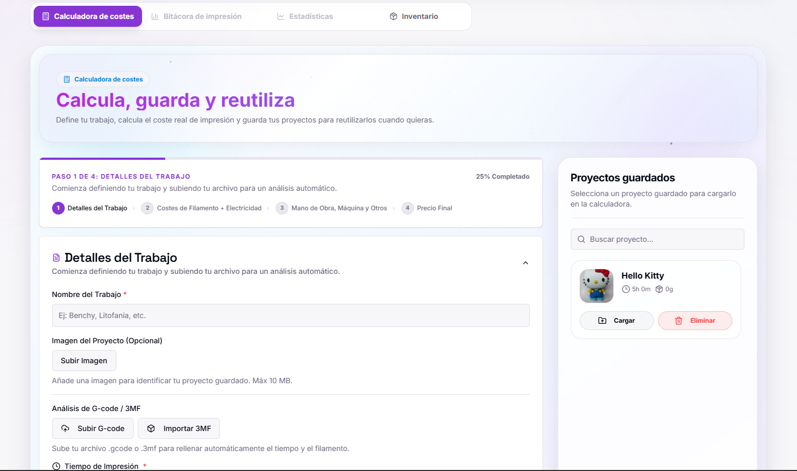
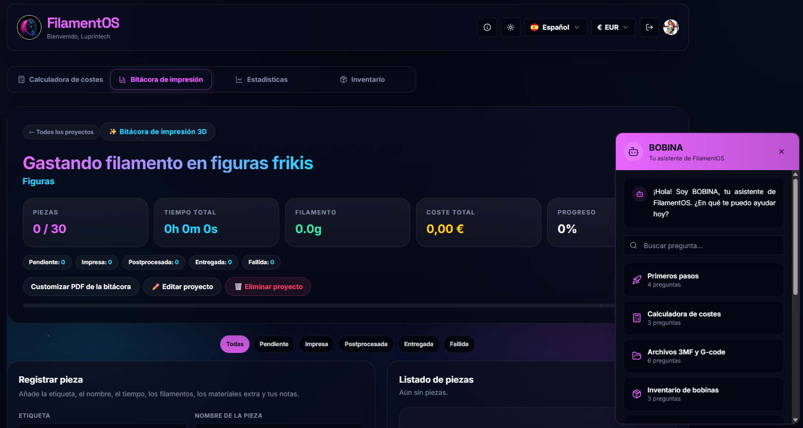
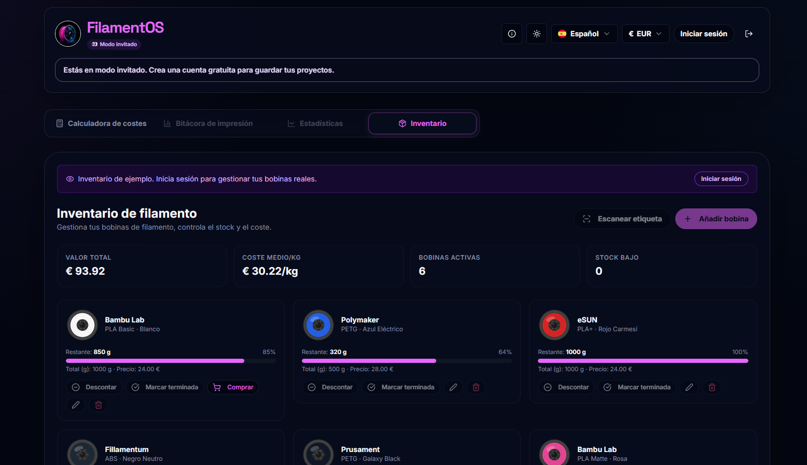
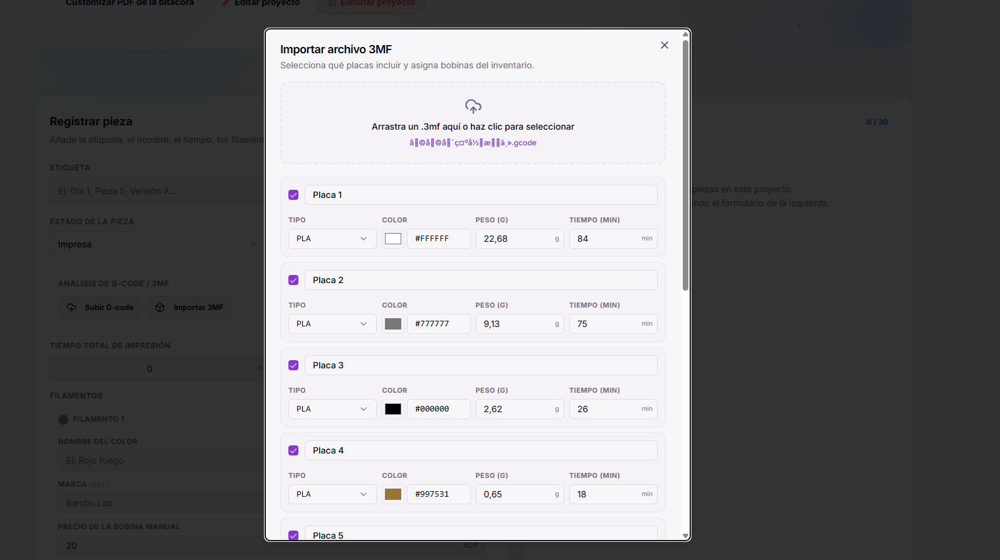
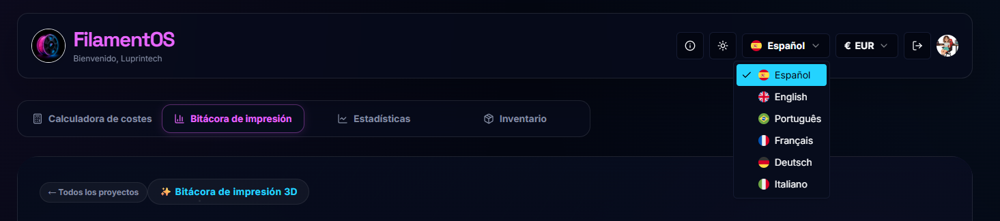
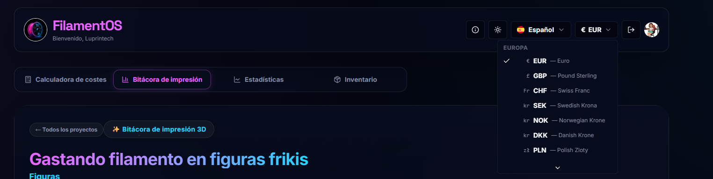
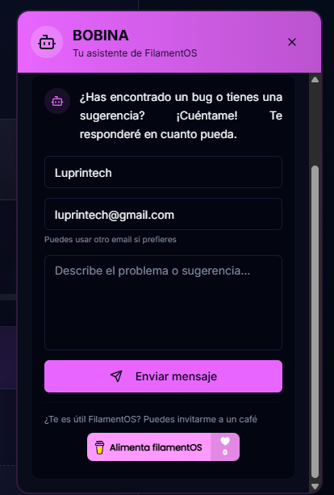

<div align="center">

  

  <h1>FilamentOS</h1>

  <p><b>El sistema operativo de tus impresiones 3D</b></p>

  <p>
    <a href="https://filamentos.luprintech.com" target="_blank">
      
    </a>
  </p>

  <p>
    
    
    
    
    
    
    
  </p>

</div>

---

Calcula costes reales, gestiona tu inventario de bobinas, lleva un tracker de proyectos y genera presupuestos PDF profesionales — todo en una sola app. Creada y mantenida por Lupe ([@Luprintech](https://www.instagram.com/luprintech/)).

---

## Capturas

<p align="center">
  
  <br/><sub>Calculadora de costes — wizard de 4 pasos con proyectos guardados</sub>
</p>

<p align="center">
  
  <br/><sub>Bitácora de impresión 3D con BOBINA, el asistente integrado</sub>
</p>

<p align="center">
  
  <br/><sub>Inventario de bobinas con valor total, coste medio y stock bajo</sub>
</p>

<p align="center">
  
  <br/><sub>Importación de archivos 3MF — extrae placas, filamentos, tiempos y pesos</sub>
</p>

<p align="center">
  
  &nbsp;&nbsp;
  
  <br/><sub>Disponible en 6 idiomas y múltiples monedas europeas</sub>
</p>

<p align="center">
  
  <br/><sub>BOBINA — asistente integrado para soporte y sugerencias</sub>
</p>

---

## Qué hace

**Calculadora de costes** — Wizard de 4 pasos que calcula filamento, electricidad, mano de obra, amortización de máquina y margen de beneficio. Exporta presupuesto en PDF personalizable con tu logo y colores.

**Importación de archivos 3MF** — Importa proyectos directamente desde Bambu Studio, PrusaSlicer u OrcaSlicer. Extrae placas, filamentos, tiempos y pesos automáticamente.

**Análisis G-code con IA** — Sube un G-code y Gemini extrae tiempo de impresión, peso de filamento y materiales sin que tengas que leer una sola línea de código.

**Inventario de bobinas** — Gestiona tu stock: marca bobinas como activas o agotadas, deduce gramos tras cada impresión y consulta el historial de consumos.

**Escáner de código de barras** — Apunta la cámara del móvil a la etiqueta de una bobina y FilamentOS rellena los datos automáticamente desde una base de datos comunitaria.

**Tracker de proyectos** — Registra cada pieza de un proyecto con su tiempo, material y estado. Exporta el informe completo en PDF.

**Estadísticas** — Resumen de proyectos, kilómetros impresos, coste total y ahorro estimado en un solo vistazo.

**Modo invitado** — Prueba la app sin cuenta. Si decides registrarte, tus datos se migran automáticamente.

---

## Stack

| Capa | Tecnología |
|---|---|
| Frontend | React 18 + TypeScript + Vite + Tailwind CSS + shadcn/ui |
| Backend | Express.js + Node.js 20 |
| Base de datos | SQLite 3 (`better-sqlite3`) |
| Autenticación | Passport.js + Google OAuth 2.0 |
| IA | Google Genkit + Gemini |
| PDF | Puppeteer + Chromium |
| i18n | i18next — ES, EN, DE, FR, IT, PT |
| Deploy | Docker + Nginx + Let's Encrypt |

---

## Instalación en desarrollo

```bash
# 1. Clona el repo
git clone https://github.com/Luprintech/filamentOS.git
cd filamentOS

# 2. Instala dependencias
npm install

# 3. Configura el entorno
cp backend/.env.example backend/.env
# Edita backend/.env con tus credenciales de Google OAuth y Gemini
```

### Variables de entorno (`backend/.env`)

```env
PORT=3001
CLIENT_ORIGIN=http://localhost:9002
SESSION_SECRET=      # genera con: node -e "console.log(require('crypto').randomBytes(64).toString('hex'))"

GOOGLE_CLIENT_ID=tu-client-id.apps.googleusercontent.com
GOOGLE_CLIENT_SECRET=tu-client-secret
GOOGLE_GENAI_API_KEY=AIzaSy...

# Opcional: integración Spoolman
# Déjalo vacío para seguir usando solo inventario local.
SPOOLMAN_BASE_URL=
SPOOLMAN_TIMEOUT_MS=10000
```

### Integración opcional con Spoolman

- `SPOOLMAN_BASE_URL`: URL base de tu instancia de Spoolman. Puede ser `https://spoolman.tudominio.com` o `https://spoolman.tudominio.com/api/v1`; FilamentOS la normaliza automáticamente.
- `SPOOLMAN_TIMEOUT_MS`: timeout del backend hacia Spoolman en milisegundos. Si tu red es lenta, súbelo; si lo dejas como está, `10000` suele ir bien.
- Si `SPOOLMAN_BASE_URL` queda vacío, la integración queda **desactivada** y el inventario sigue funcionando en modo local sin dependencias remotas.

### Configurar Google OAuth

1. [Google Cloud Console](https://console.cloud.google.com) → **APIs & Services** → **Credentials**
2. **Create Credentials** → **OAuth 2.0 Client ID** → tipo **Web application**
3. Añade en **Authorized redirect URIs**: `http://localhost:3001/api/auth/google/callback`
4. Copia el Client ID y Secret a `backend/.env`

### Arrancar

```bash
npm run dev
```

- Frontend (Vite): `http://localhost:9002`
- Backend (Express): `http://localhost:3001`

La base de datos SQLite se crea automáticamente al arrancar.

---

## Deploy con Docker

La app incluye un `Dockerfile` multi-stage listo para producción (Node 20 Alpine + Chromium para Puppeteer).

```bash
# Construir la imagen
docker build -t filamentos .

# Levantar
docker compose up -d
```

`docker-compose.yml` carga `backend/.env` mediante `env_file` y además fija en producción:

- `NODE_ENV=production`
- `DB_PATH=/data/data.db`
- `SPOOLMAN_BASE_URL` y `SPOOLMAN_TIMEOUT_MS` desde `backend/.env`

Si querés activar Spoolman en Docker, completá esas variables en `backend/.env`. Si las dejás vacías, la app arranca igual y el inventario queda en modo local.

Para un despliegue completo en VPS (Ubuntu 24.04) con Nginx, HTTPS y backups automáticos, consulta [`docs/DEPLOY_VPS.md`](docs/DEPLOY_VPS.md).

---

## Scripts

| Comando | Descripción |
|---|---|
| `npm run dev` | Frontend + backend en modo desarrollo |
| `npm run build` | Compila frontend para producción |
| `npm start` | Arranca el servidor Express |
| `npm run typecheck` | Comprueba tipos TypeScript |

---

## Cálculo de costes

```
Coste filamento  = (peso usado / peso bobina) × precio bobina
Coste eléctrico  = (vatios / 1000) × horas × coste kWh
Coste mano obra  = (prep / 60 × tarifa) + (post / 60 × tarifa)
Amortización     = coste impresora / (años × 365 × 8h) × horas + reparación

Subtotal         = filamento + electricidad + mano de obra + máquina + otros
Precio final     = (subtotal × (1 + % beneficio)) × (1 + % IVA)
```

---

## PWA

FilamentOS es una Progressive Web App instalable. En Chrome/Edge aparece el botón **Instalar** en la cabecera. En iOS/Safari: menú compartir → *Añadir a pantalla de inicio*.

---

## Privacidad

Utiliza únicamente cookies técnicas para la autenticación. Sin seguimiento ni publicidad. Política de privacidad conforme a RGPD y LSSI accesible desde el pie de página.

**Responsable:** Guadalupe Cano · luprintech@gmail.com

---

## Apoya el proyecto

<a href="https://www.buymeacoffee.com/luprintech" target="_blank">
  
</a>

---

## Contacto

[YouTube](https://www.youtube.com/@Luprintech) · [Instagram](https://www.instagram.com/luprintech/) · [TikTok](https://www.tiktok.com/@luprintech) · luprintech@gmail.com

---

<div align="center">
  © 2026 Guadalupe Cano — Todos los derechos reservados
</div>
